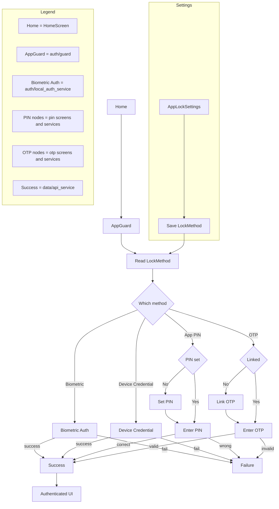

# Security Flow

Detailed mapping:

- Home: lib/home_screen.dart (initState -> _authenticateAndFetch)
- AppGuard: lib/auth/guard.dart
- Read LockMethod: lib/auth/lock_preference.dart (set in AppLockSettings)
- Biometric Auth: lib/auth/local_auth_service.dart (authBiometricOnly)
- Device Credential: lib/auth/local_auth_service.dart (authWithDeviceCredential)
- Set PIN: lib/pin/set_pin_screen.dart
- Enter PIN / PinService.verify: lib/pin/enter_pin_screen.dart, lib/pin/pin_service.dart
- Link OTP: lib/otp/link_otp_screen.dart
- Enter OTP / OtpService.verifyCode: lib/otp/enter_otp_screen.dart, lib/otp/otp_service.dart
- Authenticated UI / Success: lib/data/api_service.dart
- AppLockSettings: lib/settings/app_lock_settings.dart
- Save LockMethod: lib/auth/lock_preference.dart
